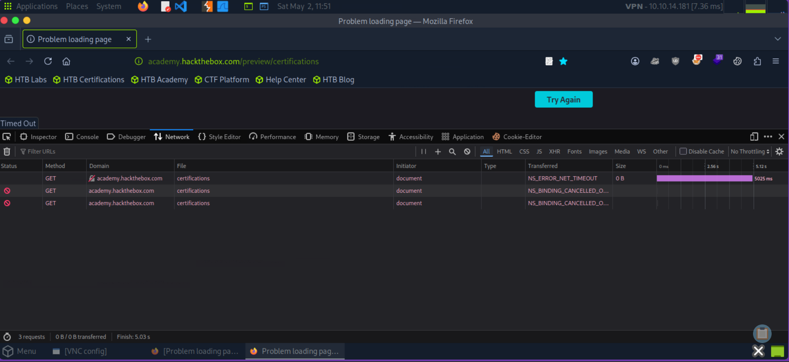
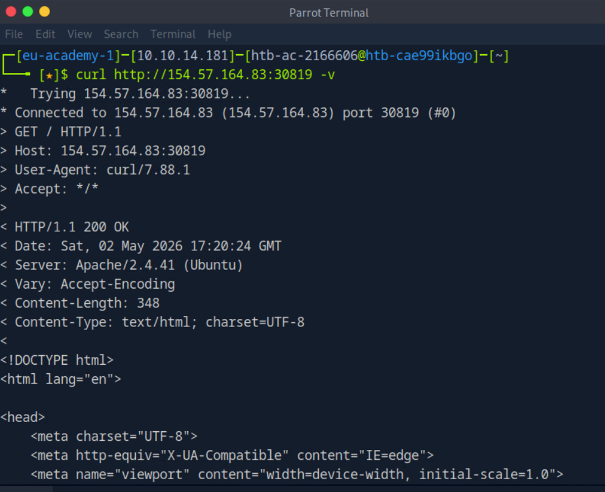

# Task 3: HTTP Requests and Responses

| Field | Details |
|-------|---------|
| **Module** | Web Requests — HTTP Fundamentals |
| **Task** | 3 of 4 |
| **Platform** | Hack The Box Academy |
| **Date Completed** | 2026-05-02 |

---

## Objective

> Intercept an HTTP request to identify the HTTP method used, then send a GET request to the target server and read the response headers to find the Apache version running on the server.

---

## Concepts Covered

- Structure of an HTTP request and HTTP response
- HTTP request fields: Method, Path, Version
- HTTP response fields: Version, Status Code
- Using `curl -v` to view full request and response
- Using Browser DevTools (Network tab) to inspect HTTP traffic

---

## Theory Summary

### HTTP Request Structure

Every HTTP request has three parts:

```
GET /users/login.html HTTP/1.1
Host: inlanefreight.com
User-Agent: Mozilla/5.0
Cookie: PHPSESSID=abc123
```

| Field | Example | Description |
|-------|---------|-------------|
| Method | `GET` | The action to perform (GET, POST, PUT, DELETE, etc.) |
| Path | `/users/login.html` | The resource being requested on the server |
| Version | `HTTP/1.1` | The HTTP version being used |

Headers follow the first line and provide extra context like the host, browser type, and cookies.

### HTTP Response Structure

The server replies with a response in this format:

```
HTTP/1.1 200 OK
Date: Tue, 21 Jul 2020 05:20:15 GMT
Server: Apache/2.4.41 (Ubuntu)
Content-Type: text/html; charset=UTF-8
```

| Field | Example | Description |
|-------|---------|-------------|
| Version | `HTTP/1.1` | HTTP version the server is using |
| Status Code | `200 OK` | Whether the request succeeded or failed |

The response body (HTML, JSON, etc.) follows after the headers, separated by a blank line.

> 💡 **Note:** HTTP/1.X sends data as cleartext separated by newlines. HTTP/2.X sends data as binary in dictionary form — more efficient but not human-readable.

---

## Environment Setup

- **Platform:** Hack The Box Academy — Pwnbox
- **Tool:** cURL, Browser DevTools
- **Target:** Spawn the instance to get your `<TARGET_IP>:<PORT>`

---

## Solution

### Question 1: What is the HTTP method used while intercepting the request?

Open **Browser DevTools** on the target page to intercept the request:

```
Press F12 (or CTRL+SHIFT+I) → Network Tab → Refresh the page
```

Look at the **Method** column in the request list. The method shown for the main page request is your answer.



---

### Question 2: Find the Apache version from the response headers

Use `curl -v` to send a GET request and view the full response headers:

```bash
curl -v http://<TARGET_IP>:<PORT>/
```



The `Server:` header in the response reveals the Apache version running on the server.

```
Answer: 2.4.41
```

> 💡 **Tip:** The `-vvv` flag gives even more verbose output — useful for deeper debugging of the connection and TLS details.

---

## Commands Used

```bash
# View full HTTP request and response headers
curl -v http://<TARGET_IP>:<PORT>/

# Extra verbose output (bonus exercise)
curl -vvv http://<TARGET_IP>:<PORT>/
```

---

## Key Takeaways

| Concept | Summary |
|---------|---------|
| HTTP request | Made up of Method + Path + Version + Headers + optional Body |
| HTTP response | Made up of Version + Status Code + Headers + optional Body |
| `curl -v` | Prints the full request (lines with `>`) and response (lines with `<`) |
| `Server:` header | Reveals the web server software and version — useful in recon |
| Browser DevTools | Network tab shows all requests/responses made by the browser in real time |
| HTTP/1.1 vs 2.X | 1.X is cleartext; 2.X is binary — both visible in DevTools |

---

## Security Insight

The `Server:` response header reveals the **exact web server software and version** running on the target. In a real penetration test, this is valuable reconnaissance — knowing the server version lets you look up known CVEs and exploits for that specific version. Many hardened servers suppress or spoof this header to prevent fingerprinting.

---

## References

- [HTB Academy — Web Requests Module](https://academy.hackthebox.com/module/35)
- [MDN — HTTP Messages](https://developer.mozilla.org/en-US/docs/Web/HTTP/Messages)
- [curl -v Documentation](https://curl.se/docs/manpage.html)

---

*Module: Web Requests | Task 3/4 — HTTP Request Responses*  
*Author: [Chamikara Mihiranga Jayasinghe] | [https://github.com/cmjayasinghe]*
