# Task 4: HTTP Headers

| Field | Details |
|-------|---------|
| **Module** | Web Requests — HTTP Fundamentals |
| **Task** | 4 of 4 — Interactive |
| **Platform** | Hack The Box Academy |
| **Date Completed** | 2026-05-03 |

---

## Objective

> Use the Browser DevTools Network tab to monitor requests made when the page loads, find the request that returns the flag, and submit it.

---

## Concepts Covered

- The 5 categories of HTTP headers and what each does
- Key request, response, and security headers
- Using `curl -I` to fetch response headers only
- Using `curl -A` to set a custom User-Agent
- Using Browser DevTools to inspect live HTTP headers and find hidden requests

---

## Theory Summary

HTTP headers pass information between the client and server. They fall into 5 categories:

### General Headers *(used in both requests & responses)*
| Header | Example | Purpose |
|--------|---------|---------|
| `Date` | `Wed, 16 Feb 2022 10:38:44 GMT` | Timestamp of the message |
| `Connection` | `keep-alive` / `close` | Whether to keep the connection open |

### Entity Headers *(describe the content being transferred)*
| Header | Example | Purpose |
|--------|---------|---------|
| `Content-Type` | `text/html` | Type of data being sent |
| `Content-Length` | `385` | Size of the body in bytes |
| `Content-Encoding` | `gzip` | Compression format applied to the data |

### Request Headers *(sent by the client)*
| Header | Example | Purpose |
|--------|---------|---------|
| `Host` | `www.inlanefreight.com` | The target server being queried |
| `User-Agent` | `curl/7.77.0` | Identifies the client (browser/tool) |
| `Cookie` | `PHPSESSID=abc123` | Session identifier sent with every request |
| `Authorization` | `BASIC cGFzc3dvcmQK` | Credentials for authenticated requests |
| `Referer` | `https://google.com` | Where the request originated from |

### Response Headers *(sent by the server)*
| Header | Example | Purpose |
|--------|---------|---------|
| `Server` | `Apache/2.2.14` | Web server software and version |
| `Set-Cookie` | `PHPSESSID=abc123` | Sends cookies to the client to store |
| `WWW-Authenticate` | `BASIC realm="localhost"` | Tells the client what auth type is required |

### Security Headers *(browser security policies)*
| Header | Example | Purpose |
|--------|---------|---------|
| `Content-Security-Policy` | `script-src 'self'` | Restricts external resource loading — prevents XSS |
| `Strict-Transport-Security` | `max-age=31536000` | Forces HTTPS — blocks HTTP downgrade attacks |
| `Referrer-Policy` | `origin` | Controls how much referrer info is shared |

---

## Environment Setup

- **Platform:** Hack The Box Academy — Pwnbox
- **Tools:** Browser DevTools (Network Tab), cURL
- **Target:** `154.57.164.77:31285`

---

## Solution

### Step 1: Open the Target in the Pwnbox Browser

Navigate to the target URL in the Pwnbox browser:

```
http://154.57.164.77:31285>/
```

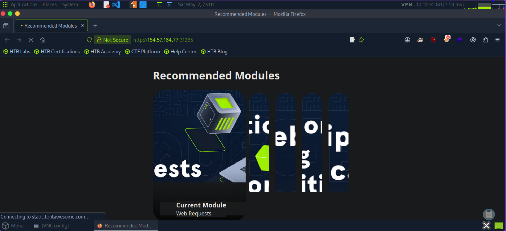

---

### Step 2: Open Browser DevTools → Network Tab

```
Press F12 (or CTRL+SHIFT+I) → click the Network tab
```

Then **refresh the page** so DevTools captures all requests made during the page load.

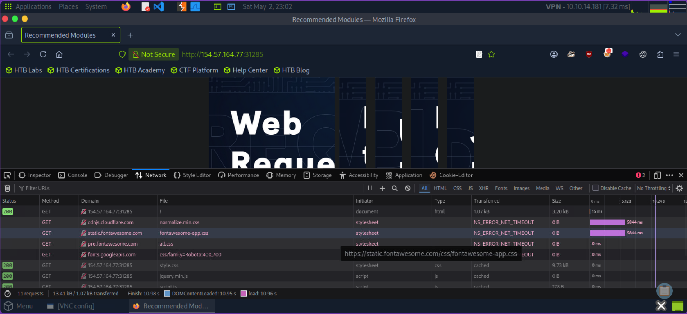

---

### Step 3: Find the Flag Request

Look through the list of requests that appear. The page loads additional requests after the initial HTML — look for a suspicious or non-standard request (e.g. a request to a `/flag` path or a `.php` file that returns flag data).

Click on the request → go to the **Response** tab → click **Raw** to view the unrendered response body.

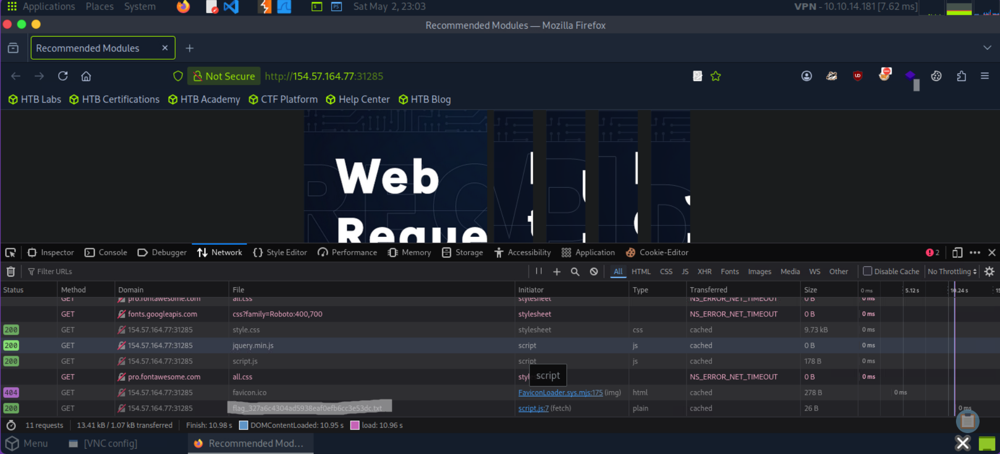

---

### Bonus: Inspect Headers with cURL

You can also view response headers directly from the Pwnbox terminal:


```bash
# View response headers only (sends a HEAD request)
curl -I http://154.57.164.77:31285/

# View headers AND response body together
curl -i http://154.57.164.77:31285/

# Set a custom User-Agent
curl -A "Mozilla/5.0" http://154.57.164.77:31285/

# Confirm User-Agent was changed by checking headers
curl -I -A "Mozilla/5.0" http://154.57.164.77:31285/
```

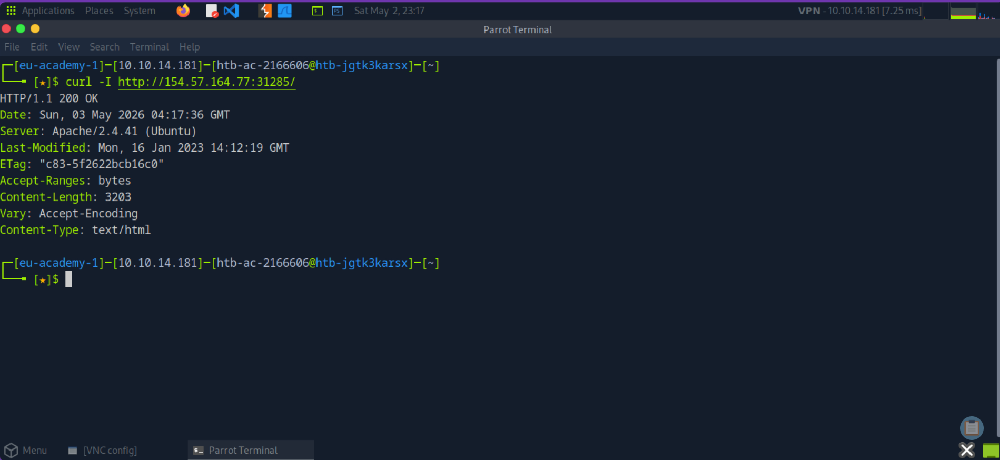

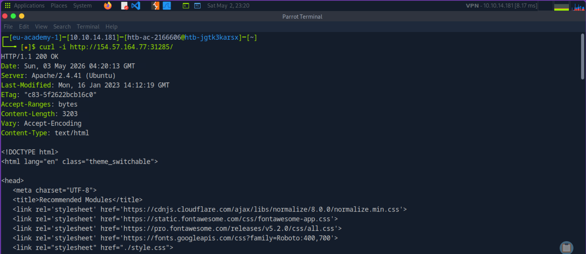
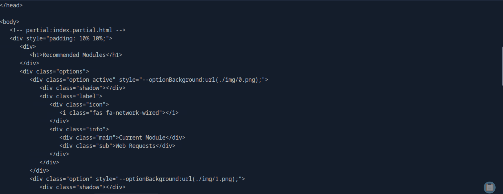
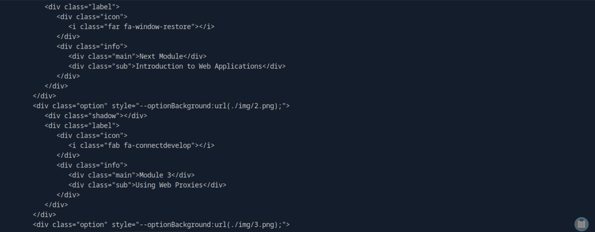
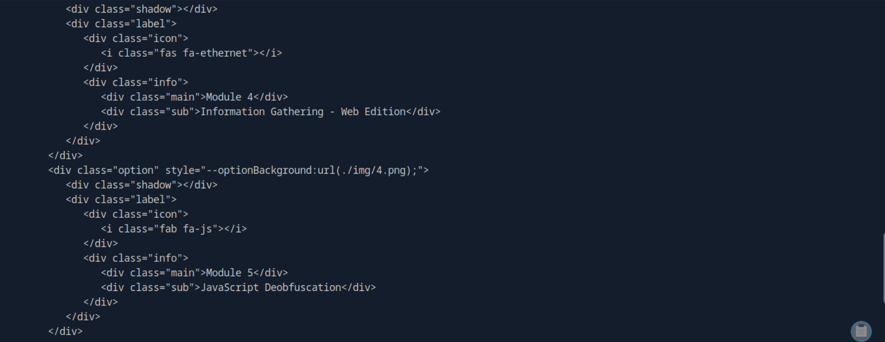
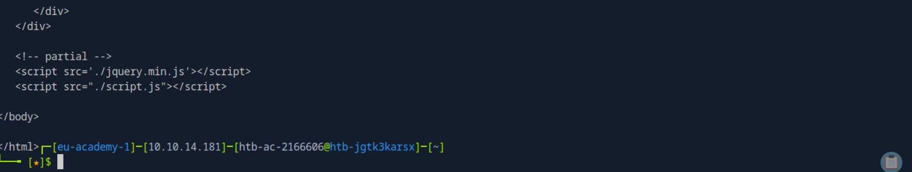

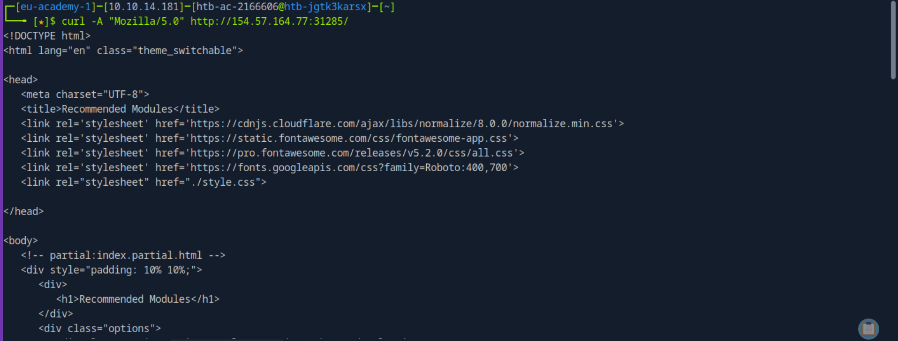
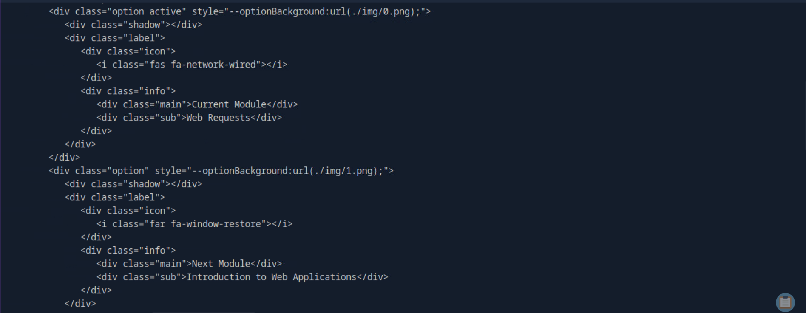
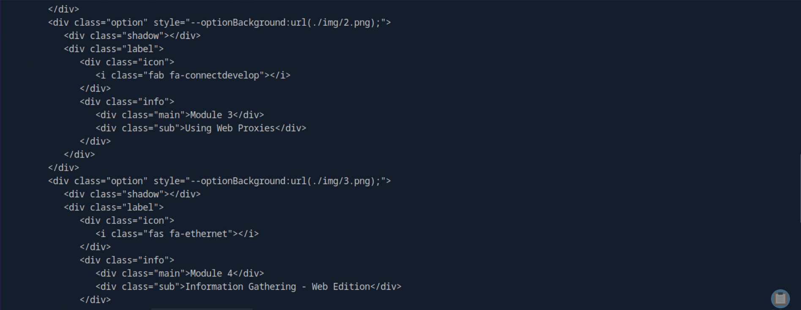
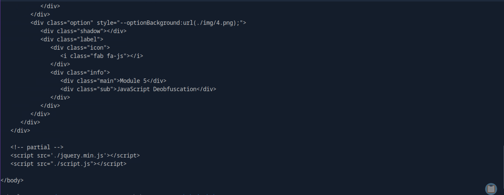

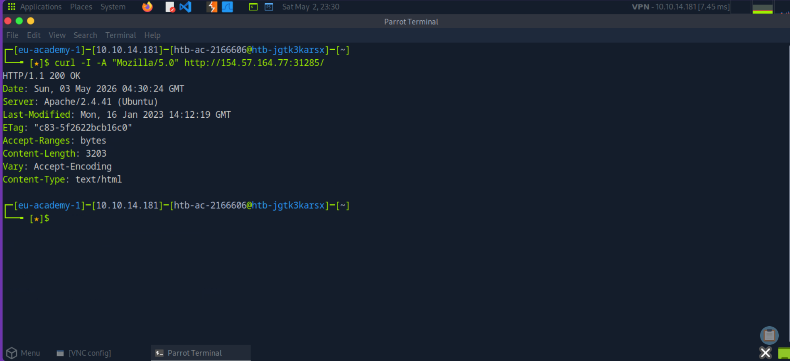

---

## Commands Used

```bash
# Fetch response headers only
curl -I http://<TARGET_IP>:<PORT>/

# Fetch headers + response body
curl -i http://<TARGET_IP>:<PORT>/

# Set custom User-Agent
curl -A 'Mozilla/5.0' http://<TARGET_IP>:<PORT>/

# Full verbose output (request + response)
curl -v http://<TARGET_IP>:<PORT>/
```

---

## Key Takeaways

| Concept | Summary |
|---------|---------|
| 5 header categories | General, Entity, Request, Response, Security |
| `Server:` header | Leaks web server version — valuable in recon |
| `Cookie:` header | Maintains session state between requests |
| `Content-Security-Policy` | Prevents XSS by restricting allowed resource origins |
| `Strict-Transport-Security` | Forces HTTPS — prevents HTTP downgrade attacks |
| `curl -I` | Sends HEAD request — returns headers only, no body |
| `curl -i` | Returns headers AND body together |
| `curl -A` | Sets a custom User-Agent string |
| DevTools Network tab | Shows every request the page makes — including hidden ones |

---

## Security Insight

The `Server:` and `Set-Cookie:` response headers are prime targets during reconnaissance. The `Server:` header reveals the exact software version, which can be matched to known CVEs. Cookies without the `HttpOnly` or `Secure` flags set can be stolen via JavaScript (XSS) or sent over unencrypted HTTP — both serious vulnerabilities to look for in a penetration test.

---

## References

- [HTB Academy — Web Requests Module](https://academy.hackthebox.com/module/35)
- [MDN — HTTP Headers](https://developer.mozilla.org/en-US/docs/Web/HTTP/Headers)
- [OWASP — Secure Headers Project](https://owasp.org/www-project-secure-headers/)

---

*Module: Web Requests | Task 4/4 — HTTP Headers*  
*Author: [Chamikara Mihiranga Jayasinghe] | [https://github.com/cmjayasinghe]*
